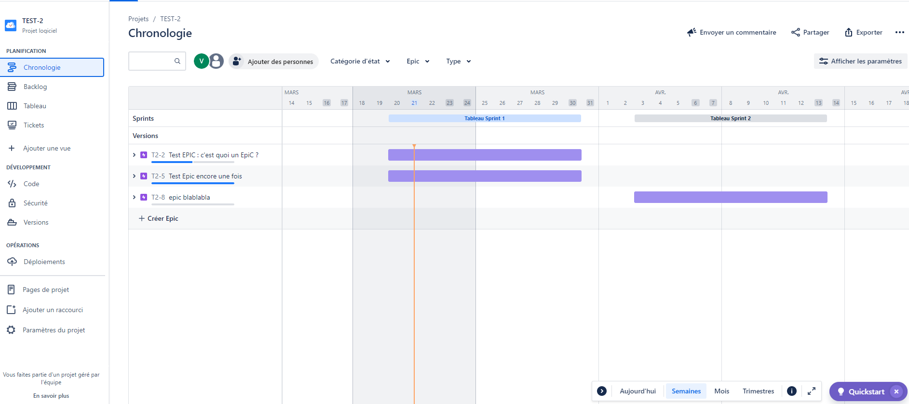
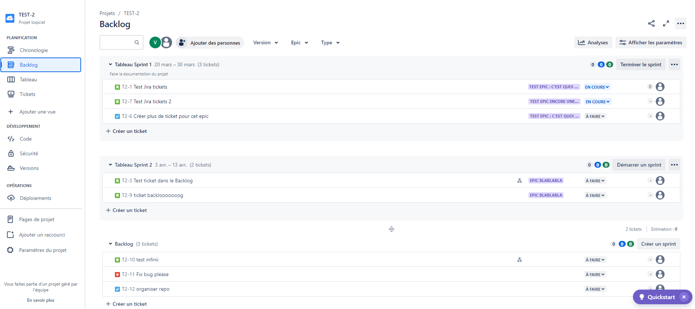
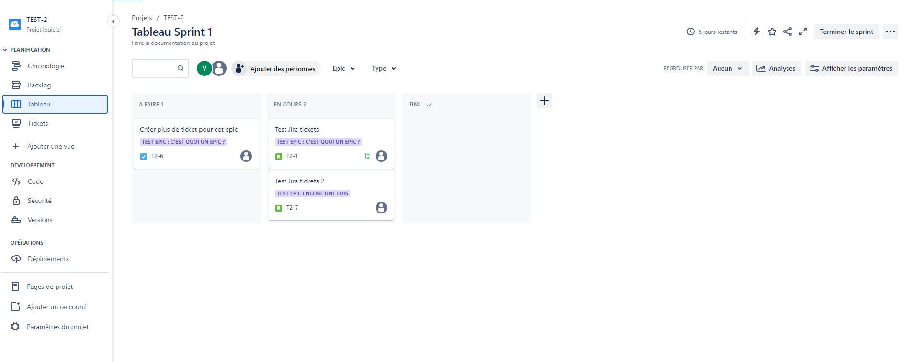
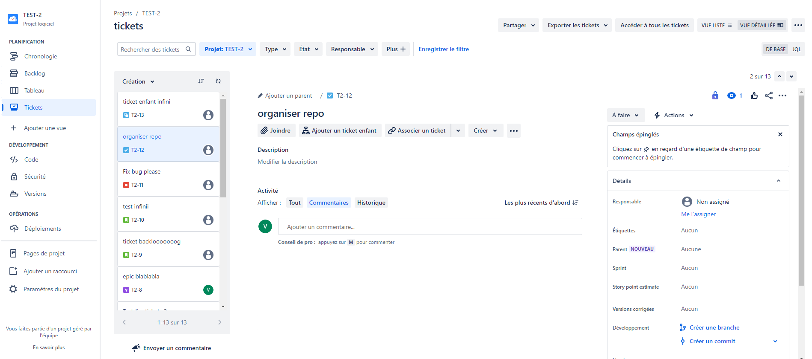

Dans Jira, les vues suivantes sont des fonctionnalités clés qui aident les équipes à gérer leurs projets de développement logiciel de manière efficace :

### Vue Stop Chronologie (Timeline View) :

**Description** : La vue Stop Chronologie dans Jira permet aux utilisateurs de visualiser les tâches, les problèmes ou les tickets de manière chronologique sur une ligne de temps. Elle offre une vue d'ensemble visuelle des activités planifiées et en cours dans le projet, ce qui facilite la gestion du calendrier et la coordination des activités.

**Utilisation** : Les équipes peuvent utiliser la vue Stop Chronologie pour planifier et suivre les jalons du projet, identifier les chevauchements de tâches, repérer les dépendances entre les activités et ajuster les plannings en conséquence. Cette vue est particulièrement utile pour les projets nécessitant une gestion précise du temps et une coordination entre plusieurs équipes ou parties prenantes.

### Vue Backlog :

**Description** : La vue Backlog dans Jira est une liste hiérarchisée des tâches ou des fonctionnalités à réaliser pour un projet donné. C'est essentiellement une liste de toutes les demandes de travail qui attendent d'être traitées ou planifiées dans les futures itérations.

**Utilisation** : Les équipes utilisent la vue Backlog pour saisir et prioriser les demandes de fonctionnalités ou de corrections de bugs. Ils peuvent déplacer les éléments du backlog dans les sprints planifiés à mesure que les priorités évoluent. Cette vue permet une planification flexible et itérative des travaux à réaliser, en aidant les équipes à rester concentrées sur les objectifs à court et à long terme du projet.

### Vue Tableau (Board View) :

**Description** : La vue Tableau dans Jira offre une représentation visuelle des tâches, des problèmes ou des tickets organisés en colonnes, représentant généralement les étapes du processus de développement (par exemple, à faire, en cours, terminé).

**Utilisation** : Les équipes utilisent la vue Tableau pour suivre l'avancement des travaux en temps réel, identifier les goulots d'étranglement, répartir équitablement les charges de travail entre les membres de l'équipe et améliorer la visibilité globale sur le flux de travail. Les vues Tableau peuvent être configurées de manière flexible pour correspondre aux processus spécifiques de l'équipe, ce qui les rend très adaptatives à différents types de projets et de méthodologies de travail.

### Vue Tickets :

**Description** : La vue Tickets dans Jira permet aux utilisateurs de consulter les détails spécifiques d'un ticket ou d'un problème, y compris les informations sur l'auteur, les commentaires, les pièces jointes, l'historique des mises à jour, etc.

**Utilisation** : Les membres de l'équipe utilisent la vue Tickets pour examiner et mettre à jour les détails des tâches assignées, suivre les discussions relatives à un problème particulier, ajouter des commentaires ou des pièces jointes, et effectuer des actions telles que la transition de l'état d'un ticket. Cette vue offre une vue détaillée et centralisée de toutes les informations pertinentes liées à un ticket spécifique, ce qui facilite la collaboration et la prise de décision au sein de l'équipe.

En utilisant ces vues dans Jira de manière appropriée, les équipes peuvent améliorer leur efficacité, leur transparence et leur capacité à livrer des produits de haute qualité dans les délais impartis.
